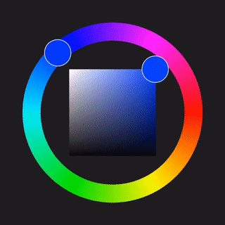

# pikko - iOS color picker made with ❤️

<!--- [](https://travis-ci.org/Sandra/Pikko)
[](https://cocoapods.org/pods/Pikko)
[](https://cocoapods.org/pods/Pikko)
[](https://cocoapods.org/pods/Pikko) --->



Created due to the lack of pretty & functionally useful color picker libraries for iOS. Feel free to use, modify and improve. ✌️

__Currently still in development__ - changes will occur frequently. Pod setup still WIP.

## Example

To run the example project, clone the repo, and run `pod install` from the Example directory first.

## Requirements

## Installation

pikko will __soon__ be available through [CocoaPods](https://cocoapods.org). To install
it, simply add the following line to your Podfile:

```ruby
pod 'Pikko'
```

## Authors

Sandra, melloskitten@googlemail.com
Johannes, mail@johannesrohwer.com

## License

__pikko__ is available under the MIT license. See the LICENSE file for more info.
